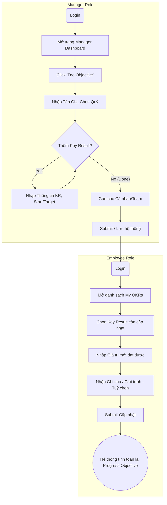

# UML Diagrams (Use Case & Flowchart)

Dưới đây là Use Case Diagram và Flowcharts sử dụng cú pháp Mermaid.

## 1. Use Case Diagram

```mermaid
usecaseDiagram
    actor Admin
    actor Manager
    actor Employee

    package "OKR Management System" {
        usecase "Login / Logout" as UC1
        usecase "View Dashboard" as UC2
        usecase "Create Objective" as UC3
        usecase "Add Key Result" as UC4
        usecase "Assign OKR" as UC5
        usecase "View Own OKRs" as UC6
        usecase "Update KR Progress" as UC7
        usecase "Add Comment/Note" as UC8
        usecase "Filter OKR by Quarter" as UC9
    }

    Admin --> UC1
    Admin --> UC2
    Admin --> UC9

    Manager --> UC1
    Manager --> UC2
    Manager --> UC3
    Manager --> UC4
    Manager --> UC5
    Manager --> UC8
    Manager --> UC9

    Employee --> UC1
    Employee --> UC6
    Employee --> UC7
    Employee --> UC8
    Employee --> UC9

    %% Relationships
    UC7 ..> UC8 : <<extend>>
    UC3 ..> UC4 : <<include>>
```

## 2. Activity Diagram (Flowchart): Tạo OKR và Cập nhật


